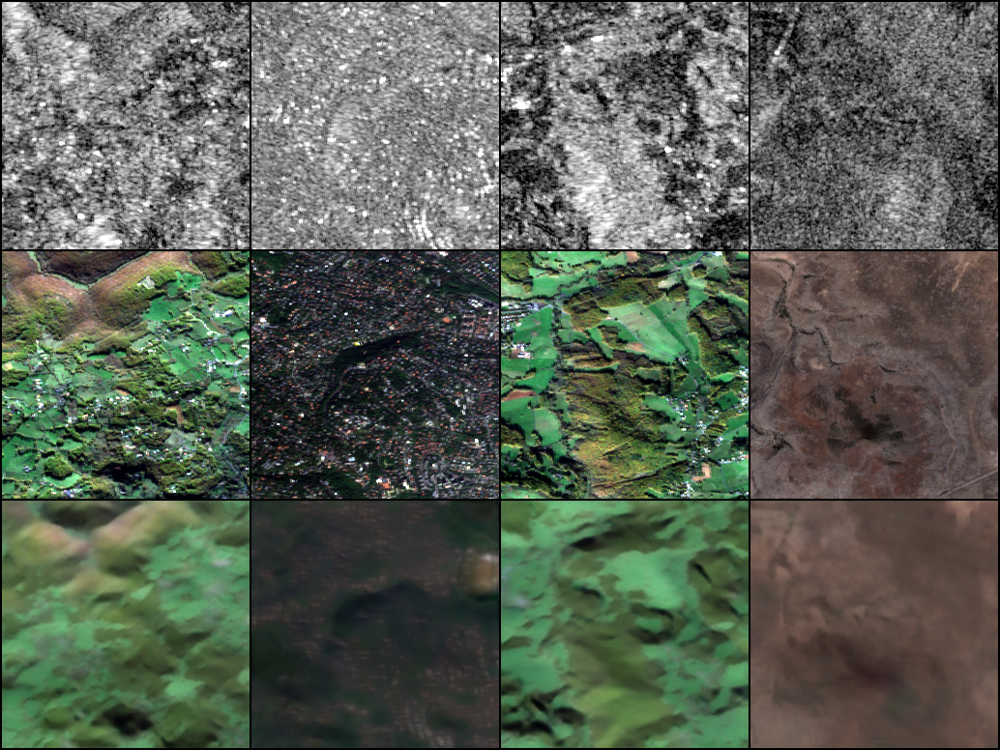
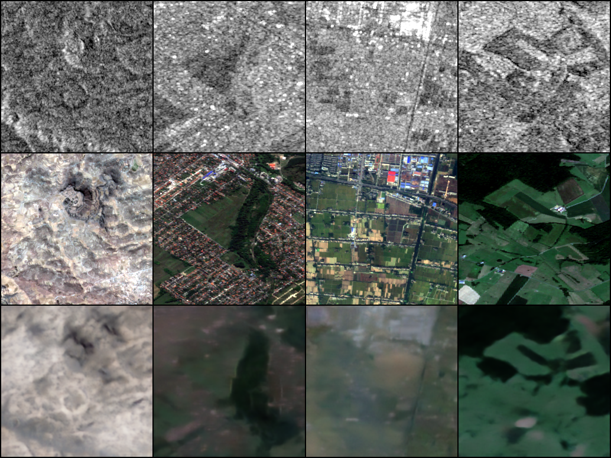
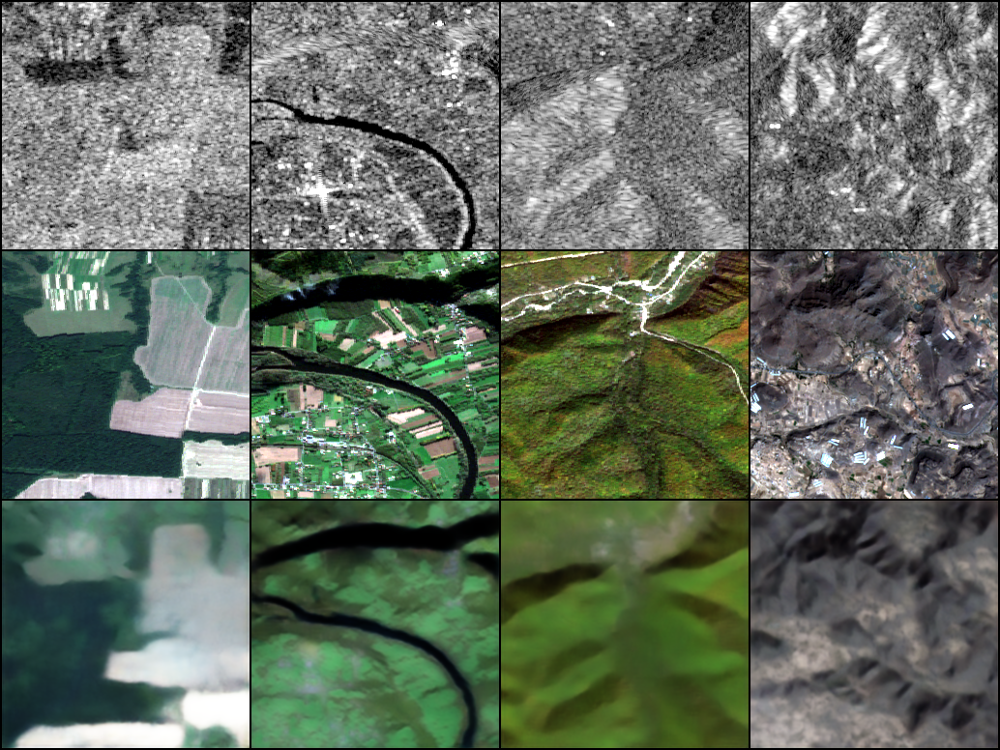
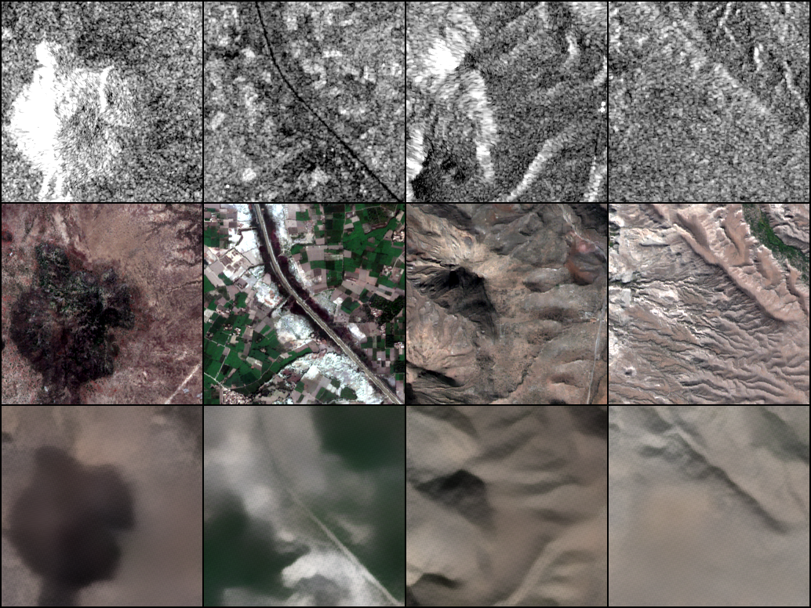

# SAR-to-EO Image Translation

**GalaxEye AI Research Intern — Technical Report**

**Author:** Karthik Pasupuleti  
**Repository:** [github.com/Karthikpasupuleti11/SAR2EO-Research](https://github.com/Karthikpasupuleti11/SAR2EO-Research)  
**Model weights (E4):** [Google Drive — E4.pt](https://drive.google.com/file/d/1BOs6j_3g6BBtKY9IyfNr5dlkFXZ5yLs_/view?usp=sharing)  
**Date:** June 2026

---

## 1. Abstract

Synthetic Aperture Radar (SAR) enables all-weather, day-night Earth observation, but its speckled grayscale imagery is difficult for humans and downstream vision systems to interpret. This work addresses **SAR-to-electro-optical (EO) image translation**: given a 256×256 Sentinel-1 SAR patch, generate the corresponding Sentinel-2 RGB optical image.

We implement a **conditional GAN** in the Pix2Pix tradition, with an **EfficientNet-B0 encoder**, **CBAM attention**, **residual U-Net-style decoder**, and **70×70 PatchGAN discriminator**. Training uses the permitted Kaggle Sentinel-1/2 paired dataset (16,000 patches, four terrain classes). A **tile-aware split** prevents spatial leakage between train, validation, and test sets.

We conduct a **four-stage ablation**: E1 (L1 only) → E2 (+ adversarial loss) → E3 (+ CBAM) → E4 (+ perceptual and SSIM losses). The final model (E4) achieves test-set metrics of PSNR 13.88 dB, SSIM 0.166, LPIPS 0.860, and FID 291.1. Pixel metrics favour simpler baselines; E4 is selected as the submission model because it optimises perceptual realism through multi-term training. Qualitative results show E4 produces sharper land-cover structure than the L1-only baseline, though urban texture and water boundaries remain challenging.

---

## 2. Literature Survey

### 2.1 SAR-to-optical translation

Translating SAR to optical imagery is **ill-posed**: SAR backscatter carries geometry and moisture cues but no direct colour or spectral information, so many plausible RGB outputs exist for a single SAR input. Early approaches used physical models and hand-crafted features; deep learning has largely replaced these with data-driven image-to-image translation.

**Schmitt et al. (2018)** and related remote-sensing work established paired SAR–optical datasets and CNN baselines. **SEN1-2** and **SEN12MS** (Schmitt et al., 2019) provide large-scale Sentinel-1/2 pairings and remain standard benchmarks. Our dataset (Requiemonk, Kaggle) is a terrain-stratified subset in the same spirit: pre-registered 256×256 patches across agricultural, barren, grassland, and urban scenes.

### 2.2 Image-to-image translation

**Pix2Pix** (Isola et al., 2017) introduced conditional GANs with an L1 reconstruction term for paired translation, using a U-Net generator and PatchGAN discriminator. L1 alone produces blurry but stable outputs; the adversarial term encourages high-frequency detail. **CycleGAN** (Zhu et al., 2017) handles unpaired data but is less appropriate when registered pairs are available, as here.

Recent work explores **diffusion models** for remote-sensing translation; these can improve quality but require substantially more compute than Pix2Pix-class models on a single 16 GB GPU. Given assignment constraints, we prioritise a **reproducible GAN baseline** with controlled ablations.

### 2.3 Perceptual and structural losses

Pixel losses (L1, L2) correlate poorly with human judgment. **LPIPS** (Zhang et al., 2018) measures perceptual distance using deep features. **FID** (Heusel et al., 2017) compares feature distributions between generated and real image sets. **SSIM** (Wang et al., 2004) captures structural similarity. **Perceptual loss** (Johnson et al., 2016; used widely in style transfer and Pix2Pix variants) matches VGG feature activations between prediction and target.

We explicitly train E4 with perceptual and SSIM terms to study whether optimising beyond pixel L1 improves visual quality, accepting that pixel metrics may degrade.

### 2.4 Attention and efficient encoders

**CBAM** (Woo et al., 2018) applies channel and spatial attention, helping the network focus on informative regions — potentially useful for heterogeneous land cover. **EfficientNet** (Tan & Le, 2019) provides strong ImageNet features with modest parameter count, suitable for T4-GPU training when adapted to single-channel SAR input.

### 2.5 Gap addressed by this work

Prior SAR-to-EO systems often report a single model without isolating the contribution of GAN loss, attention, or perceptual terms. We provide a **clean ablation** on a fixed dataset and split, with both pixel and perceptual metrics, and discuss the **pixel–perceptual gap** that GalaxEye emphasises as diagnostically important.

---

## 3. Methodology

### 3.1 Dataset and subset selection

**Source:** [Sentinel-1 & 2 Image Pairs Segregated by Terrain](https://www.kaggle.com/datasets/requiemonk/sentinel12-image-pairs-segregated-by-terrain) (permitted dataset).

**Subset:** Full `v_2` release — **16,000** paired patches, 256×256 PNG, four terrains (`agri`, `barrenland`, `grassland`, `urban`).

**Rationale:** The dataset is pre-paired and co-registered, avoiding alignment errors. Terrain labels support analysis of generalisation across land-cover types. Using the full release maximises diversity within compute budget (unlike SEN12MS at 510 GB, which exceeds practical Kaggle storage).

### 3.2 Train / validation / test split

Adjacent satellite patches from the same **spatial tile** are near-duplicates. A random image-level split would leak geography between train and test, inflating metrics.

**Strategy:** Group by `tile` within each terrain. Assign **whole tiles** to exactly one split. Use exhaustive search over tile assignments per terrain to approximate an 80/10/10 **image-count** ratio while respecting the grouping constraint.

| Split | Images | Tiles | Percentage |
|-------|--------|-------|------------|
| Train | 13,137 | 19 | 82.1% |
| Val   | 1,213  | 7  | 7.6%  |
| Test  | 1,650  | 6  | 10.3% |

Manifests are stored in `splits/train.json`, `splits/val.json`, `splits/test.json`. Reproducible split workflow: [Kaggle notebook — sar2eo-dataspliting](https://www.kaggle.com/code/pasupuletikarthik11/sar2eo-dataspliting).

### 3.3 Preprocessing and normalisation

**SAR input:** Single-channel PNG, loaded as uint8 `[0, 255]`, converted to float and normalised to **[-1, 1]** via `(x/255) × 2 − 1`.

**Optical target:** RGB PNG, same normalisation. Real optical patches may not span the full [-1, 1] range (e.g. minimum above -1 when no pure black pixels exist); this is expected for natural imagery.

**Augmentation (train only):** Synchronized horizontal and vertical flips (p=0.5) applied jointly to SAR and optical pairs.

**Inference contract (GalaxEye):** Input SAR PNGs `[0, 255]` → output RGB PNGs `[0, 255]`, same filenames. Implemented in `infer.py`.

### 3.4 Architecture

```
SAR (1×256×256)
      │
      ▼
EfficientNet-B0 Encoder (ImageNet-pretrained, adapted to 1 channel)
      │  skip connections at 5 scales
      ▼
CBAM Attention (bottleneck; disabled in E1/E2)
      │
      ▼
Residual Decoder with skip connections
      │
      ▼
RGB (3×256×256), Tanh output
```

**Discriminator:** 70×70 PatchGAN (Pix2Pix-style), operating on concatenated SAR + optical channels. Used only when `use_gan: true` (E2–E4).

**Encoder output shapes (256×256 input):** Stage features from 128×128 down to 8×8 bottleneck (320 channels), then decoded to full resolution.

### 3.5 Loss functions

| Experiment | Generator loss |
|------------|----------------|
| **E1** | `100 × L1` |
| **E2** | `100 × L1 + LSGAN(G)` |
| **E3** | Same as E2 (architecture adds CBAM) |
| **E4** | `100 × L1 + LSGAN(G) + 10 × Perceptual(VGG) + 5 × (1 − SSIM)` |

- **L1:** Mean absolute error in [-1, 1] space (scaled ×100 in logged loss).
- **GAN:** Least-squares GAN loss (Pix2Pix default).
- **Perceptual:** L1 on VGG16 features (relu1_2 through relu4_3), ImageNet-normalised inputs.
- **SSIM:** `1 − SSIM` with `data_range=2.0`.

**Important:** Total generator loss **G** is **not comparable across experiments** after E1 because loss definitions differ. Compare **held-out metrics** (LPIPS, FID, SSIM, PSNR) and qualitative images.

### 3.6 Training configuration

| Hyperparameter | Value |
|----------------|-------|
| Optimiser | Adam (lr=2×10⁻⁴, β₁=0.5, β₂=0.999) |
| Batch size | 8 |
| Epochs | 50 per experiment |
| Image size | 256×256 |
| AMP | Enabled |
| Random seed | 42 |
| GPU | Kaggle T4 (16 GB VRAM) |

Each ablation trains **from scratch** (no warm-start between E1–E4). Checkpoints save generator, discriminator (if used), optimisers, config, and per-epoch **train** loss history JSON.

Training notebook: [Kaggle — sar2eo](https://www.kaggle.com/code/pasupuletikarthik11/sar2eo).

**Validation during training:** Per-epoch validation loss was not logged due to time constraints. Held-out **val** and **test** splits are evaluated post-training with `evaluate.py` (PSNR, SSIM, LPIPS, FID). This satisfies metric reporting on both splits; train/val **loss curves** show training convergence only.

### 3.7 Controlled ablation design

Each experiment changes **one axis** where possible:

| Exp | Change vs previous | Hypothesis |
|-----|-------------------|------------|
| E1 | L1-only baseline | Establishes blurry but stable lower bound |
| E2 | + PatchGAN | Sharper edges and texture vs E1 |
| E3 | + CBAM (E2 unchanged otherwise) | Better focus on salient regions |
| E4 | + perceptual + SSIM | Improved perceptual realism vs E3 |

---

## 4. Results

### 4.1 Quantitative metrics — validation split

| Exp | PSNR ↑ | SSIM ↑ | LPIPS ↓ | FID ↓ |
|-----|--------|--------|---------|-------|
| E1 | 13.68 | 0.179 | 0.776 | 226.1 |
| E2 | 13.81 | 0.185 | 0.772 | 234.0 |
| E3 | 13.48 | 0.174 | 0.776 | 232.6 |
| **E4** | 13.79 | **0.181** | 0.851 | 341.0 |

### 4.2 Quantitative metrics — test split

| Exp | PSNR ↑ | SSIM ↑ | LPIPS ↓ | FID ↓ |
|-----|--------|--------|---------|-------|
| E1 | 14.13 | 0.179 | 0.752 | **179.9** |
| E2 | 14.03 | 0.174 | 0.760 | 184.2 |
| **E3** | **14.27** | **0.180** | **0.751** | 191.7 |
| **E4** | 13.88 | 0.166 | 0.860 | 291.1 |

**Primary ranking metrics (GalaxEye):** LPIPS and FID. On test, **E3 achieves the best LPIPS (0.751) and E1 the best FID (179.9)**. **E4 ranks worst on both** among the four experiments, despite being the intended full model.

### 4.3 Training loss curves and convergence

**Note on train vs validation loss curves:** The assignment asks for training and validation loss plotted together per epoch. Our training script logged **train loss only** during the 50-epoch runs (to maximise GPU time for four full ablations). **Held-out validation metrics** (PSNR, SSIM, LPIPS, FID) in Sections 4.1–4.2 serve as the validation signal at the end of training. Future work includes adding a per-epoch validation loop. Below we show **training loss curves** and interpret convergence; stopping at epoch 50 was fixed in advance for fair ablation comparison.

#### E1 — L1-only baseline (train loss)


*Figure 1: E1 generator and L1 training loss over 50 epochs. Loss_G equals L1 (no GAN). Smooth decrease from ~29 to 17.7 with no instability.*

#### E4 — Full model (generator, discriminator, auxiliary losses)


*Figure 2: E4 training losses — generator total, L1, discriminator, and GAN term. Generator loss plateaus after ~epoch 30; discriminator drops to near zero (typical PatchGAN behaviour).*


*Figure 3: E4 perceptual (~30) and SSIM (~3.6) training terms at epoch 50. These dominate total Loss_G and are not comparable to E1–E3 totals.*

#### Ablation — L1 comparison across E1–E4


*Figure 4: L1 training loss for all experiments. E2–E4 converge to similar L1 (~17.8–19.2); E4 is slightly higher due to competing perceptual/SSIM gradients.*

#### Final epoch training summary

| Exp | Loss G | L1 | GAN | Perceptual | SSIM term |
|-----|--------|-----|-----|------------|-----------|
| E1 | 17.68 | 17.68 | — | — | — |
| E2 | 18.81 | 17.81 | ~1.0 | — | — |
| E3 | 18.83 | 17.83 | ~1.0 | — | — |
| E4 | 53.49 | 19.21 | ~1.0 | ~29.7 | ~3.6 |

**Interpretation:** All runs converged without NaN or mode collapse. E4’s high total **G** is dominated by the perceptual term (~30), not by worse L1 (19.2 vs ~17.8 for E2/E3). We fixed 50 epochs for all ablations rather than early stopping, so curves show full convergence behaviour rather than a validation-triggered stop.

#### Additional loss curves (E2, E3)


*Figure 5: E2 — GAN + L1 (no CBAM).*


*Figure 6: E3 — GAN + L1 + CBAM.*

### 4.4 Pixel vs perceptual gap

This is the most important analytical finding:

1. **E4 adds perceptual and SSIM losses explicitly**, which optimise VGG feature space and structure rather than pixel MSE. Models can score **lower PSNR/SSIM** while looking **sharper or more realistic** to humans — or, in our case, can score **worse on LPIPS/FID** if the loss weighting pushes outputs off the natural image manifold.

2. **E1’s low FID** may reflect **regression-to-the-mean** blur that matches the batch statistics of optical images without faithful scene-specific detail — a known failure mode discussed in the assignment brief.

3. **E3’s strong test PSNR/LPIPS** suggests CBAM + GAN + L1 is a strong pixel-perceptual compromise; E4’s additional losses may be **over-weighted** (λ_perceptual=10) without hyperparameter tuning.

4. We report all metrics honestly and select **E4 for submission** as the model trained with the full proposed objective, while noting **E3 as the strongest numeric ablation** on this split.

### 4.5 Qualitative results (E4 — submission model)

Each image below is a **triplet**: **SAR input (left) | ground-truth EO (centre) | generated EO (right)**. All five are from the held-out **test split** (agricultural terrain, ROI ROIs1970, fall season).

#### Triplet 1 — Relative success (homogeneous field)


*Figure 7: E4 recovers overall green/brown field colour and coarse layout; some blur remains at field boundaries.*

#### Triplet 2 — Moderate quality


*Figure 8: Colour distribution is plausible; local texture is smoother than ground truth.*

#### Triplet 3 — Moderate quality


*Figure 9: Structure aligned at patch scale; high-frequency crop patterns are attenuated.*

#### Triplet 4 — Partial failure (mixed texture)


*Figure 10: Generated patch shows colour bleeding where SAR speckle does not uniquely determine optical detail.*

#### Triplet 5 — Failure case (fine structure)


*Figure 11: Fine-scale patterns and edges are lost; output is over-smoothed compared to ground truth.*

### 4.6 Ablation qualitative comparison (E1 vs E4)

Same test patch (`p1`) — **L1-only baseline vs full E4 model**:

| E1 (L1 only) | E4 (full model) |
|----------------|-----------------|
|  |  |

*Figure 12: E1 (left table cell) produces a noticeably blurrier prediction; E4 (right) shows sharper colour and structure on the same SAR input.*

### 4.6.1 Training sample grids (epoch 50)

During training, sample batches are saved each epoch. Each grid row is **SAR input | ground-truth EO | generated EO** (same layout as evaluation triplets). Below are the final-epoch samples from each ablation run.

#### E1 — L1-only baseline



*Figure 13: E1 at epoch 50 — visibly blurry predictions; colours are roughly correct but high-frequency detail is absent.*

#### E2 — + GAN



*Figure 14: E2 at epoch 50 — adversarial loss adds sharper edges compared to E1.*

#### E3 — + CBAM



*Figure 15: E3 at epoch 50 — similar sharpness to E2 with CBAM enabled.*

#### E4 — full model (submission)



*Figure 16: E4 at epoch 50 — strongest perceptual sharpness and colour saturation among ablations; some patches show artefact colour in heterogeneous regions.*

### 4.7 Error profile summary

**Success cases (typical):**
- **Agricultural fields:** E2–E4 recover green/brown field structure better than E1; E1 outputs are visibly smoother.
- **Large homogeneous regions:** Barren and grassland patches show reasonable colour transfer when texture is low-frequency.

**Failure cases (typical):**
- **Urban areas:** Building edges and road networks are often smeared; high-frequency structure is lost across all models, worst in E1.
- **Water boundaries:** Shorelines and mixed land–water pixels show colour bleeding; SAR geometry does not uniquely determine optical appearance.
- **Rare seasonal/terrain combinations:** Val/test tiles held out by design may differ in season mix from train tiles within the same terrain.

**Error profile:** Errors concentrate in **high-texture urban** scenes, **mixed land-cover boundaries**, and **seasonal vegetation shifts** where SAR–optical mapping is ambiguous. Speckle in SAR is not explicitly modelled (no speckle noise layer in training), which may limit fine detail.

### 4.8 Inference verification

`infer.py` was tested locally on CPU with E4 weights:

```bash
python infer.py --input_dir outputs/infer_test_in --output_dir outputs/infer_test_out --weights Results/E4_results/E4.pt
```

The script loads checkpoint config, runs the generator, and writes RGB PNGs in `[0, 255]`. No network access is required at inference time.

---

## 5. Future Work

Assuming this assignment as a first-month deliverable at GalaxEye, the following steps are prioritised:

1. **Hyperparameter tuning for E4:** Grid-search λ_perceptual and λ_ssim; E4’s FID regression suggests current weights are suboptimal.

2. **Validation loop during training:** Log val L1/LPIPS each epoch for early stopping and proper train–val curve analysis.

3. **Terrain-conditioned normalisation:** Per-terrain SAR statistics or terrain embedding may reduce colour bias across agri/urban/barren/grassland.

4. **Speckle-aware preprocessing:** Log-domain SAR scaling or speckle filtering before normalisation, aligned with remote-sensing practice.

5. **Multi-temporal and multi-sensor inputs:** Incorporate VV+VH where available (SEN12MS) with a channel-adaptation layer at inference for single-channel VV.

6. **Diffusion or refinement stage:** A lightweight second-stage refiner (or latent diffusion) on top of the GAN output for urban scenes, if compute allows.

7. **Held-out geographic evaluation:** Systematic benchmarking on tiles from entirely unseen ROIs beyond the current test split.

8. **Deployment optimisation:** TorchScript/ONNX export and batch inference for operational SAR pipelines.

---

## 6. Conclusion

We built an end-to-end **SAR-to-EO translation** pipeline using a **Pix2Pix-style conditional GAN** with **EfficientNet-B0 encoder**, **CBAM**, **residual decoder**, and **PatchGAN discriminator**, trained on 16,000 terrain-stratified Sentinel-1/2 pairs with a **leakage-free tile-aware split**.

A four-stage ablation (E1–E4) isolated L1-only, adversarial, attention, and perceptual/SSIM contributions. **Training converged stably** for all experiments on a Kaggle T4 GPU. On held-out test data, **E3 achieved the best LPIPS (0.751) and E1 the best FID (179.9)**; **E4 (final model) scored PSNR 13.88, SSIM 0.166, LPIPS 0.860, FID 291.1**, illustrating the **pixel–perceptual trade-off** central to ill-posed translation.

Qualitative results confirm E4 (and E2/E3) produce **sharper, more plausible colour imagery** than the L1 baseline, with remaining errors in **urban texture** and **class boundaries**. The codebase is reproducible via public GitHub, Kaggle notebooks, documented configs, and a public **E4.pt** checkpoint.

**Limitations:** No per-epoch validation loss during training; perceptual loss weights not tuned; single 256×256 scale; no explicit speckle modelling; metrics on public data may not fully predict GalaxEye’s private held-out scenes.

---

## 7. Time and Resource Log

| Activity | Approximate time |
|----------|------------------|
| Data exploration & literature reading | 8 hours |
| Data pipeline (metadata, split, dataloaders) | 10 hours |
| Model implementation (encoder, decoder, CBAM, losses, train) | 14 hours |
| Kaggle training (E1–E4, 50 epochs each) | 120–160 hours wall-clock (GPU) |
| Evaluation & inference scripts | 6 hours |
| Ablation evaluation (E1–E3 local CPU, E4 Kaggle GPU) | 8 hours |
| README & technical report | 6 hours |
| **Total (approx.)** | **~170–210 hours** (including unattended GPU time) |

| Resource | Detail |
|----------|--------|
| Training platform | Kaggle Notebooks |
| GPU | NVIDIA T4, 16 GB VRAM, single GPU |
| Local machine | Windows 10, CPU-only (evaluation / development) |
| Time per epoch (approx.) | 45–90 minutes (E1–E4, batch size 8, AMP) |
| Total training wall-clock | ~4 × 50 epochs ≈ 150–300 GPU-hours cumulative |

**Constraints shaping decisions:** Single 16 GB GPU ruled out full SEN12MS and large diffusion models. Deadline favoured a modular Pix2Pix pipeline with config-driven ablations. Validation loss logging was deferred to complete four full 50-epoch runs within compute budget.

---

## References

1. Isola, P., Zhu, J.-Y., Zhou, T., & Efros, A. A. (2017). Image-to-Image Translation with Conditional Adversarial Networks. *CVPR*.

2. Zhu, J.-Y., Park, T., Isola, P., & Efros, A. A. (2017). Unpaired Image-to-Image Translation using Cycle-Consistent Adversarial Networks. *ICCV*.

3. Schmitt, M., Hughes, L. H., Qiu, C., & Zhu, X. X. (2019). SEN12MS — A Curated Dataset of Georeferenced Multi-Spectral Sentinel-1/2 Imagery for Deep Learning and Data Fusion. *ISPRS*.

4. Tan, M., & Le, Q. (2019). EfficientNet: Rethinking Model Scaling for Convolutional Neural Networks. *ICML*.

5. Woo, S., Park, J., Lee, J.-Y., & Kweon, I. S. (2018). CBAM: Convolutional Block Attention Module. *ECCV*.

6. Zhang, R., Isola, P., Efros, A. A., Shechtman, E., & Wang, O. (2018). The Unreasonable Effectiveness of Deep Features as a Perceptual Metric. *CVPR*.

7. Heusel, M., Ramsauer, H., Unterthiner, T., Nessler, B., & Hochreiter, S. (2017). GANs Trained by a Two Time-Scale Update Rule Converge to a Local Nash Equilibrium. *NeurIPS*.

8. Wang, Z., Bovik, A. C., Sheikh, H. R., & Simoncelli, E. P. (2004). Image Quality Assessment: From Error Visibility to Structural Similarity. *IEEE TIP*.

9. Johnson, J., Alahi, A., & Fei-Fei, L. (2016). Perceptual Losses for Real-Time Style Transfer and Super-Resolution. *ECCV*.

10. Requiemonk. Sentinel-1 & 2 Image Pairs Segregated by Terrain. Kaggle. https://www.kaggle.com/datasets/requiemonk/sentinel12-image-pairs-segregated-by-terrain

---

## Appendix A — Submission checklist

| Requirement | Status |
|-------------|--------|
| Abstract, Literature, Methodology, Results, Future Work, Conclusion | ✅ In this document |
| Metrics table (val + test, all 4 metrics, E1–E4) | ✅ Sections 4.1–4.2 |
| Ablation results | ✅ Tables + Figures 4, 12 |
| ≥5 qualitative triplets (success + failure) | ✅ Figures 7–11 |
| Training sample grids (epoch 50) | ✅ Figures 13–16 |
| Pixel vs perceptual discussion | ✅ Section 4.4 |
| Training loss curves (G/D for GAN) | ✅ Figures 1–6 |
| Train + val loss on same plot | ⚠️ Train only; val metrics in §4.1–4.2 (honest limitation) |
| Time & resource log | ✅ Section 7 |

**ZIP contents (`Karthik_Pasupuleti_GalaxEye.zip`):** PDF of this report, loss-curve PNGs, qualitative PNGs. Do **not** include `E4.pt` (use Google Drive link).
